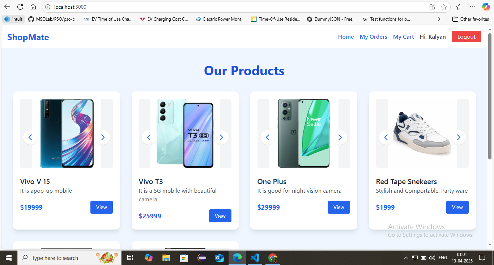
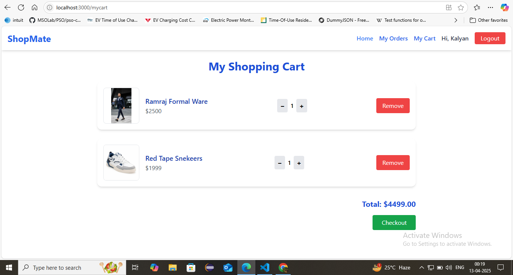
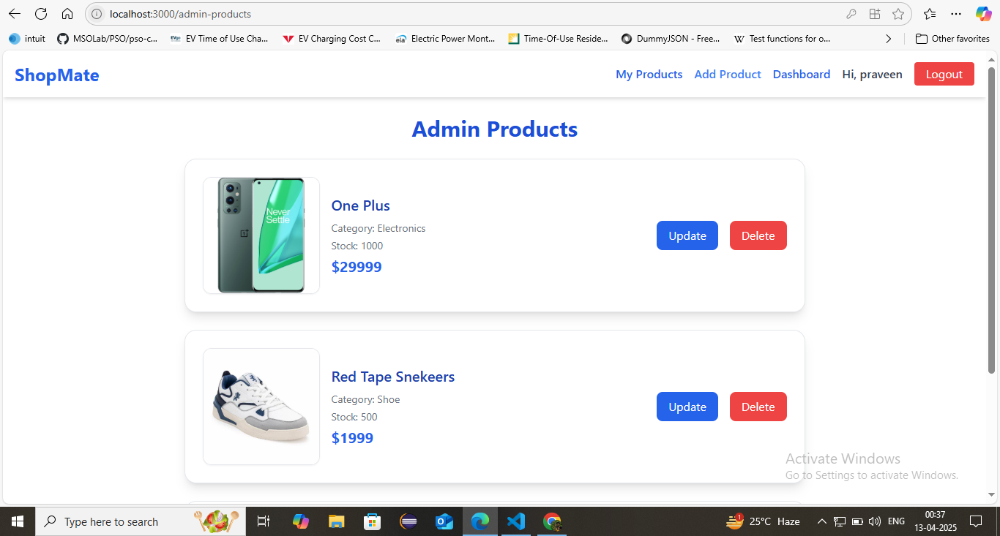

# 🚀 Ecommerce full stack

Developed a fully functional, responsive full-stack e-commerce platform with features for both users and administrators.

## 🖼️ Demo
**Home Page**

**My Cart page**

**Admin Products page**


## 🎯 Core Features

### 🔹 Frontend (React + Tailwind CSS)
- 🛒 Product listing and product details pages
- ➕ Add to cart / ➖ Remove from cart functionality
- 📱 Responsive design (mobile-first with Tailwind CSS)
- 🔐 Authentication system (Register / Login with protected routes)
- 💳 Checkout process and order summary page
- 🧑‍💼 Admin Dashboard to manage:
  - Products
  - Orders
  - Users

### 🔹 Backend (Express + MongoDB)
- ⚙️ RESTful API with full CRUD operations
- 🔐 Auth routes: register, login, and secure JWT-based authentication
- 🛍️ Product routes: create, read, update, delete products
- 📦 Order routes: place orders, view orders, update status
- 👥 User roles with access control (admin vs customer)
- 🖼️ Image uploads via Multer for product management


## 🧰 Tech Stack

### 🖥️ Frontend
- **React.js** – Component-based UI
- **Tailwind CSS** – Utility-first CSS for rapid styling
- **Axios** – For HTTP requests
- **React Router DOM** – Client-side routing

### 🌐 Backend
- **Node.js** – JavaScript runtime
- **Express.js** – Web framework for APIs
- **Multer** – For handling file uploads (e.g. product images)
- **JWT & bcrypt.js** – Authentication and security

### 🗃️ Database
- **MongoDB** – local NoSQL database
- **Mongoose** – ODM to interact with MongoDB

### ☁️ Tools
- **Thunder Clien** – API testing
- **Git & GitHub** – Version control

## 📁 Folder Structure 

### 🖥️ Frontend (`/client`)
- **/components**
- **/pages**
- **/hooks**
- **/context**


### 🌐 Backend (`/server`)
- **/controllers**
- **/models**
- **/routes**
- **/middleware**
- **/config**


## 📦 Installation

```bash
git clone https://github.com/yourusername/yourrepo.git
cd yourrepo
npm install
npm start
